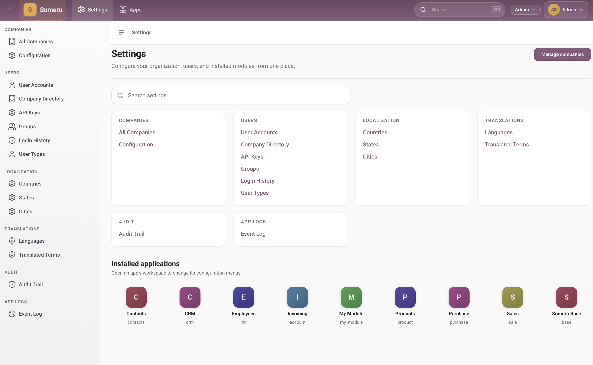

# Sumeru

**Modular open-source ERP — Go backend, PostgreSQL, and a modern web workspace.**

[](https://go.dev/dl/)
[](LICENSE)
[](https://github.com/ProjectMeru/sumeru)
[](https://projectmeru.github.io/sumeru/docs/)



*Settings hub — configure companies, users, localization, and open installed apps.*

> [!CAUTION]
>
> **Pre-alpha software** — not for production or commercial use.
>
> - Do not deploy live business workloads; stability and data integrity are not guaranteed.
> - APIs, data models, and behavior may change without notice.
> - Use for local development, evaluation, and feedback only.

Sumeru is a modular ERP platform built in **Go**. Install **apps** (addons) for CRM, sales, inventory, and more; persist data in **PostgreSQL**; define screens with XML **views**; and run day-to-day work in a **SWC** workspace client (list, form, kanban, graph, pivot, calendar, and more).

This repository is the **core engine** (`module sumeru`). Most teams keep it pull-only and run the server from **[sumeru_custom_addons](https://github.com/ProjectMeru/sumeru_custom_addons)**.

## Key features

- **Modular apps** — manifests, XML views/menus, Go models, install and update from disk
- **PostgreSQL ORM** — model sync on startup, record rules, multi-company support
- **Web workspace** — app launcher, home, settings hub, tree/form/kanban and analysis views
- **SWC client** — TypeScript workspace UI compiled to `core/engine/assets/swc/swc.js`
- **JSON-RPC API** — `POST /api/rpc` for integrations (session or API key)
- **Stable addon SDK** — prefer **`sumeru/core/sdk`** over direct **`sumeru/core/orm`** imports
- **Plain CSS shell** — design tokens and `sum-*` layout under `core/engine/assets/css/`

## Quick start

**Prerequisites:** [Go 1.26.2+](https://go.dev/dl/), [PostgreSQL](https://www.postgresql.org/)

Clone the three sibling repositories, configure the workspace, generate imports, and run:

```bash
mkdir -p ~/sumeru_erp && cd ~/sumeru_erp
git clone git@github.com:ProjectMeru/sumeru.git
git clone git@github.com:ProjectMeru/sumeru_addons.git
git clone git@github.com:ProjectMeru/sumeru_custom_addons.git

# Create a PostgreSQL database matching db_name in your INI, e.g.:
#   psql -c "CREATE DATABASE sumeru;"

cd sumeru_custom_addons
cp sumeru.conf.example sumeru.conf   # edit db_*, http_port, addons_path
make replace-sumeru
make replace-sumeru-addons
make generate
make run
```

Open **`http://localhost:8080`** (or your `http_port`). `/` redirects to **`/web/apps`**.

**Day-to-day updates:**

```bash
cd ../sumeru && git pull
cd ../sumeru_addons && git pull
cd ../sumeru_custom_addons && make generate && make run
```

Full workspace details: **[sumeru_custom_addons README](https://github.com/ProjectMeru/sumeru_custom_addons/blob/main/README.md)**.

### Core-only (optional)

When you only need kernel apps under `sumeru/addons/`:

```bash
cd sumeru
cp sumeru.conf.example sumeru.conf
make generate && make run
```

Install sample data, then serve: `go run ./cmd/sumeru -- -c sumeru.conf -i company,user --stop-after-init` then `make run`.

## Architecture

Sumeru splits across three repositories so you can pull engine and standard apps without mixing customer code.

```text
sumeru_custom_addons  ──replace + make generate──►  sumeru (core)
         │                                              │
         └──replace + addons_path──────────────────────►│
         │                                              ▼
         └──make run────────────────────────────►  HTTP server
                ▲
                └── also loads  sumeru_addons (standard business apps)
```

| Repository | Role |
| ---------- | ---- |
| **[sumeru](https://github.com/ProjectMeru/sumeru)** | Core engine + kernel apps (`base`, `mail`, …) |
| **[sumeru_addons](https://github.com/ProjectMeru/sumeru_addons)** | Standard business apps (CRM, Sales, Inventory, …) |
| **[sumeru_custom_addons](https://github.com/ProjectMeru/sumeru_custom_addons)** | Your workspace: custom addons, INI, generated imports, `make run` |

**Entry binary:** `cmd/sumeru/main.go` → `sumeru/core/server`. Library code under `core/` has no `main`.

## Tech stack

| Layer | Technology |
| ----- | ---------- |
| Server | Go 1.26.2+, structured logging (`log/slog`) |
| Database | PostgreSQL |
| Modules | Go addons + XML views/menus + manifest sync |
| Workspace UI | SWC (TypeScript) → `core/swc/` |
| Styling | Plain CSS (`core/engine/assets/css/`) |
| API | JSON-RPC at `POST /api/rpc`, health at `GET /api/health` |

**Common commands (this repo):** `make generate` · `make run` · `make build` · `make swc` (rebuild client). CLI flags: `-c` config, `-d` database, `-p` port, `-i` install modules, `-u` update modules.

## Documentation

| Resource | Contents |
| -------- | -------- |
| [Documentation home](https://projectmeru.github.io/sumeru/docs/) | Guides, reference, and tutorials |
| [Installation](https://projectmeru.github.io/sumeru/docs/guides/start/installation.html) | First-time setup |
| [Configuration](https://projectmeru.github.io/sumeru/docs/guides/start/configuration.html) | `sumeru.conf` keys and paths |
| [JSON-RPC API](https://projectmeru.github.io/sumeru/docs/reference/json-rpc.html) | RPC methods, auth, errors |
| [SWC architecture](https://projectmeru.github.io/sumeru/docs/guides/concepts/swc-architecture.html) | Workspace client |
| [Creating an addon](https://projectmeru.github.io/sumeru/docs/guides/build/creating-an-addon.html) | Module authoring |
| [Tooling](https://projectmeru.github.io/sumeru/docs/guides/build/tooling.html) | Makefile, import-gen, CLI |
| [sumeru_addons README](https://github.com/ProjectMeru/sumeru_addons/blob/main/README.md) | Standard business apps |
| [sumeru_custom_addons README](https://github.com/ProjectMeru/sumeru_custom_addons/blob/main/README.md) | Workspace runner |

Configuration template: **`sumeru.conf.example`** in this repo.

## Project layout

| Path | Purpose |
| ---- | ------- |
| `core/orm/` | PostgreSQL models, CRUD, registry |
| `core/engine/` | View XML, HTML render, templates, assets |
| `core/server/` | INI config, HTTP handlers |
| `core/module/` | Addon discovery, install/update |
| `core/sdk/` | Stable Go API for addons |
| `core/swc/` | Workspace UI source (TypeScript) |
| `cmd/sumeru/` | Server binary + generated imports |
| `addons/` | Kernel apps shipped with core |
| `test/` | Unit and integration tests |

## Contributing

See **[CONTRIBUTING.md](CONTRIBUTING.md)** for where to put changes, the generate/test loop, and PR expectations. Please follow the **[Code of Conduct](CODE_OF_CONDUCT.md)**.

## Security

Report vulnerabilities privately — see **[SECURITY.md](SECURITY.md)**. Do not open public issues for undisclosed security problems.

## License

Licensed under the [Apache License, Version 2.0](LICENSE).
