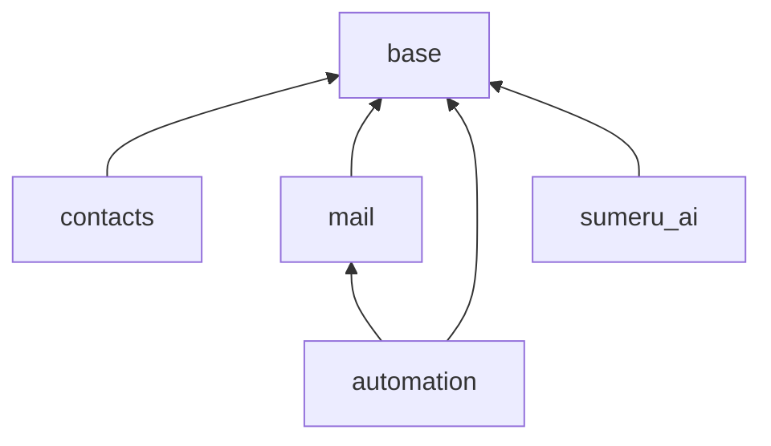

# Sumeru core addons

Installable modules shipped with the `sumeru` Go module. Each folder name equals the manifest `name`.

## Module index

| Module | Type | Depends | Purpose |
|--------|------|---------|---------|
| **base** | Application | — | Kernel: users, companies, partners, geo, i18n, platform metadata |
| **contacts** | Application | base | Contacts app over `core.partner` (reference layout) |
| **mail** | Technical | base | Chatter (`mail.message`), activities, `PostMessage` API |
| **automation** | Technical | base, mail | Cron, workflow transitions, server actions on events |
| **sumeru_ai** | Application | base | Optional AI shell hooks (`auto_import: false`) |

## Dependency graph



## Reference addon

Use **[contacts/](contacts/)** as the gold standard for new modules:

- Split views: `{model}_{type}_views.xml`
- Window actions in `views/actions.xml` with `<action type="window">`
- Security first in manifest, menus last
- Model extend in `models/partner_extend.go`, view inherit in `views/*_inherit_views.xml`

Full rules: [core/module/addon_template/MODULE_STANDARD.txt](../core/module/addon_template/MODULE_STANDARD.txt)

## Scaffold

```bash
make bp NAME=my_module
make generate
go run ./cmd/sumeru -- -c sumeru.conf -i my_module
```
