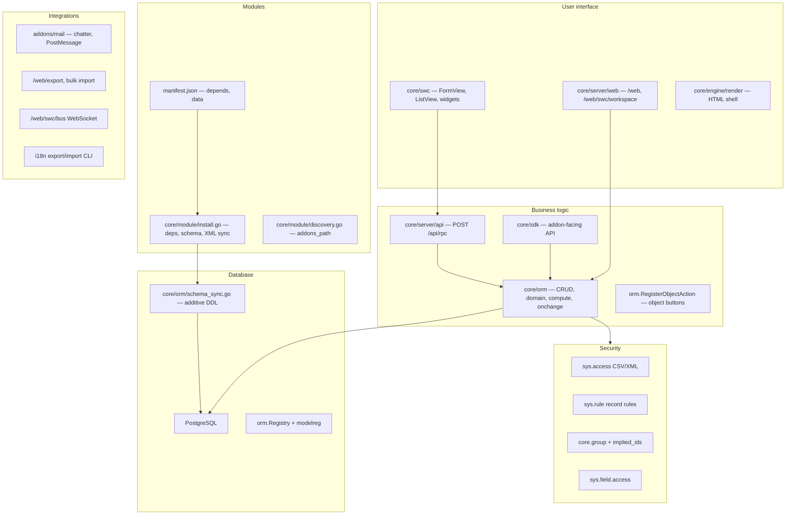

# Sumeru layered architecture

Sumeru is a modular ERP built as a **Go monolith** with **PostgreSQL**, **XML-defined** UI and metadata, and a **hybrid web client** (SWC SPA inside a server-rendered shell). This document maps the six runtime layers, how requests flow through them, and how modules extend each other without forking core code.

## Six layers



| Layer | Primary paths | Request flow |
| ----- | ------------- | ------------ |
| **UI** | [`core/swc/src/views/`](../core/swc/src/views/), [`core/server/web/workspace.go`](../core/server/web/workspace.go), [`core/engine/parser/view_xml.go`](../core/engine/parser/view_xml.go) | Browser → `GET /web/swc/workspace` (arch + records JSON) → SWC renders; mutations → `POST /api/rpc` |
| **Business logic** | [`core/orm/`](../core/orm/), [`core/server/api/dispatch.go`](../core/server/api/dispatch.go), [`core/sdk/`](../core/sdk/) | RPC → `dispatchRPC` → model methods → ORM with ACL/rules applied |
| **Modules** | [`core/module/`](../core/module/), [`addons/*/manifest.json`](../addons/base/manifest.json) | `-i module` → resolve `depends` → `syncModuleSchema` → load `data` XML (two-pass for view inherits) |
| **Security** | [`core/orm/model_acl.go`](../core/orm/model_acl.go), [`core/orm/record_rules.go`](../core/orm/record_rules.go), addon `security/` | Checked on every CRUD/search; rules compiled into SQL WHERE |
| **Integrations** | [`addons/mail/`](../addons/mail/), [`core/server/web/export_handlers.go`](../core/server/web/export_handlers.go), [`core/event/`](../core/event/) | Chatter, exports, event bus, cron — invoked from Go hooks, not XML alone |
| **Database** | [`core/orm/schema_sync.go`](../core/orm/schema_sync.go), [`core/orm/registry.go`](../core/orm/registry.go) | `SyncModels` / `SyncRegistrySchemaForModule` on startup and install |

## End-to-end traces

### Open partner form

1. User opens Contacts → partner list → clicks a row.
2. **`core/server/web`** serves the workspace shell; **`core/swc`** loads via `/static/swc/swc.js`.
3. Client requests workspace JSON (`GET /web/swc/workspace`) with model `core.partner`, view type `form`, and record id.
4. Server loads **`sys.view.arch`** (merged if view inherits were applied), fetches the row from **`core_partner`** via **`core/orm`**, applies field ACL and record rules.
5. SWC **`FormView`** renders fields from arch + record values.

### Save via RPC

1. Client posts to **`POST /api/rpc`** (`write` or `create` on `core.partner`).
2. **`core/server/api/dispatch.go`** validates session/API key, resolves the model from **`orm.Registry`**, runs ACL and record rules.
3. **`core/orm`** builds SQL UPDATE/INSERT; **`schema_sync`** has already ensured columns exist from field definitions.
4. Optional hooks: mail chatter, **`event.Subscribe`** listeners in addon `init.go`.

### Install contacts module

1. CLI: `go run ./cmd/sumeru -- -c sumeru.conf -i contacts --stop-after-init`
2. **`core/module/install.go`** resolves `depends: ["base"]`, installs base first if needed.
3. **`SyncRegistrySchemaForModule("contacts")`** runs additive DDL for models **owned** by contacts and models **extended** by contacts (see model inherit below).
4. **`core/module/data_sync.go`** loads manifest `data` XML: security, actions, inline views, then **second pass** for `inherit_id` view records.
5. View inherit merges xpath into the parent **`sys.view.arch`** row ([`core/engine/viewinherit/xpath.go`](../core/engine/viewinherit/xpath.go)).

## Inheritance catalog

| Mechanism | Status | Where |
| --------- | ------ | ----- |
| **View inherit** (`inherit_id` + xpath) | Implemented | [`core/engine/viewinherit/`](../core/engine/viewinherit/), [`core/module/data_sync_views.go`](../core/module/data_sync_views.go). Example: [`addons/contacts/views/core_partner_form_inherit_views.xml`](../addons/contacts/views/core_partner_form_inherit_views.xml) |
| **Model inherit** (`inherit=` struct tag) | Implemented | [`core/modelmeta/model_spec.go`](../core/modelmeta/model_spec.go), [`core/modelreg/register.go`](../core/modelreg/register.go). Example: [`addons/contacts/models/partner_extend.go`](../addons/contacts/models/partner_extend.go) |
| **Module depends** | Implemented | `manifest.depends` + topological install |
| **Field extension without inherit** | Implemented | `related=`, `compute=` tags in [`core/orm/related.go`](../core/orm/related.go) |
| **Bridge modules** | Pattern | Small addon with `depends` on two apps — see docs on cross-module flows |
| **Events** | Pattern | `event.Subscribe` in addon `init.go` instead of copying Go code |

### View inherit (example)

The contacts addon adds **`customer_rank`** to the partner form by inheriting its own base form view:

```xml
<record id="view_core_partner_form_contacts_inherit" model="sys.view">
  <field name="inherit_id" ref="contacts.view_core_partner_form"/>
  <field name="arch" type="xml">
    <xpath expr="//field[@name='phone']" position="after">
      <field name="customer_rank" string="Customer Rank"/>
    </xpath>
  </field>
</record>
```

### Model inherit (example)

Extend **`core.partner`** with a new stored field from the contacts module:

```go
type PartnerContacts struct {
    sdk.Model `sumeru:"inherit=core.partner"`
    CustomerRank sdk.Integer `sumeru:"string=Customer Rank,default=0"`
}
```

Run **`make generate`** so **`models/zmodels.go`** registers the struct. On `-u contacts`, schema sync adds the **`customer_rank`** column to **`core_partner`**.

## See also

- [Architecture overview](https://projectmeru.github.io/sumeru/docs/core/architecture/overview.html) (published docs mirror)
- [Creating an addon](https://projectmeru.github.io/sumeru/docs/guides/build/creating-an-addon.html)
- [View inherit xpath how-to](https://projectmeru.github.io/sumeru/docs/core/howtos/view-inherit-xpath.html)
- [Model inherit how-to](https://projectmeru.github.io/sumeru/docs/core/howtos/model-inherit.html)
